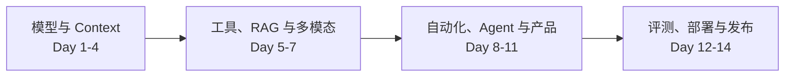

# AI Native

这是一套面向软件工程师的 14 天 AI Native 广度训练。每天投入约 6 小时，通过一个连续项目理解模型、Context、RAG、工具、Agent、自动化、评测与生产工程。

  

    <strong>14 天</strong>
    连续课程
  

  

    <strong>84 小时</strong>
    学习与实战
  

  

    <strong>1 个</strong>
    可部署应用
  

  

    <strong>20+</strong>
    自动评测
  

## 最终成果

- 用一张技术地图解释 AI 应用的主要技术及关系
- 根据质量、成本、延迟、安全和复杂度做基本选型
- 把 AI 编程和自动化用于个人及团队工作
- 独立开发、评测并部署一个小型 AI 应用

## 课程结构

  

    01
    <h3>建立基础地图</h3>
    
理解模型能力、Prompt、Context、结构化输出和可靠 API。

    <a href="./course/day-01-landscape">从 Day 1 开始</a>
  

  

    02
    <h3>连接知识与工具</h3>
    
掌握 Tool Calling、MCP、检索、RAG 和多模态输入。

    <a href="./course/day-05-tools-mcp">进入 Day 5</a>
  

  

    03
    <h3>设计工作系统</h3>
    
区分 Workflow 与 Agent，建立团队可复用的自动化流程。

    <a href="./course/day-08-automation">进入 Day 8</a>
  

  

    04
    <h3>完成生产闭环</h3>
    
补齐产品交互、评测、安全、可观测性、部署和发布。

    <a href="./course/day-12-production-quality">进入 Day 12</a>
  

## 学习方法

每天按同一套循环执行：

1. 先回答当日决策题，留下初始判断。
2. 阅读必读资料，每天最多 1.5 小时。
3. 完成最小实验，记录失败而不只保留成功结果。
4. 把当天能力合并到“团队知识与任务助手”。
5. 执行验收清单，更新技术地图、判断矩阵和复盘。

先阅读 [完整路线图](./roadmap.md) 和 [主线项目说明](./project/project-brief.md)，然后开始 [Day 1：AI 技术全景](./course/day-01-landscape.md)。

## 开始前准备

- 可用的 Git、编辑器和熟悉的语言运行环境
- 至少一个模型 API 凭据或本地模型运行环境
- 5 至 10 份可以安全用于实验的团队文档
- 10 条真实问题和 3 份会议记录样例
- 每天固定的 6 小时时间块

不要把客户、员工、密钥、合同或未公开业务信息上传到未经批准的模型服务。
