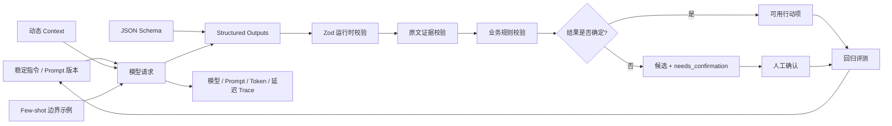

# Day 2：Prompt、Context 与结构化输出技术地图

最后更新：2026-07-19

## 关键节点

### Prompt 与动态 Context

- Prompt 定义目标、业务边界、约束和完成标准，并使用版本号管理。
- 动态 Context 提供本次会议正文、当前日期、时区和输出偏好。
- 两者都位于 Context Window 中，但在工程排障时分别代表规则和事实。

### Structured Outputs 与 Zod

- Structured Outputs 在生成阶段约束字段和类型。
- Zod 在应用边界再次执行运行时校验和跨字段不变量。
- 两者保证结构，不保证字段值真实。

### 证据与业务校验

- 模型返回逐字引文，应用验证引文确实存在于原文。
- 人员、日期、冲突和相对时间还需业务规则校验。
- 能由代码确定性计算的信息，不要求模型猜测。

### 不确定性与人工确认

- 缺失字段用 `null`。
- 冲突保留候选值和各自证据。
- `needs_confirmation` 阻止不确定结果直接触发真实写操作。

### Eval 与 Trace

- Eval 分别统计 Schema、证据、Precision、Recall、字段正确率和捏造次数。
- Trace 记录模型、Prompt/Schema 版本、Token、延迟、状态和错误码，不记录凭据。
- 失败 Case 进入回归集，推动下一版 Prompt 和 Schema。

## 每日修改记录

| 日期 | 新增/修改节点 | 原因 | 证据 |
| --- | --- | --- | --- |
| 2026-07-19 | Prompt、动态 Context、Structured Outputs、Zod、证据、确认、Eval、Trace | Day 2 将聊天式 Prompt 落成可验证接口 | `/actions/extract`、10 Case Floway 实测与 30 个自动测试 |
