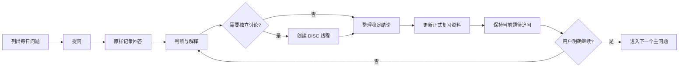

# 可复用学习系统

这套方法用于当前 14 天 AI Native 课程，也可以通过全局 Codex skill `run-learning-program` 复用到任何新仓库和学习方向。

## 内容的权威层级

| 位置 | 职责 | 权威性 |
| --- | --- | --- |
| `docs/learning/day-XX-agenda.md` | 每日问题清单、状态和主线游标 | 导航 |
| `docs/learning/day-XX-notes.md` | 原始回答、纠错和掌握状态 | 历史记录 |
| `docs/discussions/` | 跨主题或跨天的展开讨论 | 暂定内容 |
| `docs/review/` | 校正、核验和整理后的知识 | 唯一正式资料 |

原始记录帮助观察理解过程，但不能作为正确答案使用。需要正式查阅时只看 `docs/review/`。

## 每日学习循环

每个知识问题都记录：问题、原始回答、判断、参考答案、解释、适用边界、易错点、记忆句和复习状态。回答即使错误、不完整或“不知道”，也必须原样保留。

首轮解释完成不代表问题结束。此时状态进入 `待追问`，主线游标仍指向当前问题。只有学习者明确表示“继续”“下一题”或“没有追问了”，才把当前问题标记为 `已完成` 并激活下一题。

## 展开讨论与回溯

当前问题的一句话澄清留在每日学习记录。满足以下任一条件时创建全局 `DISC-NNN` 线程：

- 跨越多个课程主题
- 需要详细推理、案例或图表
- 结论尚不稳定
- 需要资料查证或动手实验
- 可能跨天继续

讨论完成阶段性整理后，根据 agenda 中保存的主线游标返回当前问题。不得假设学习者已经没有追问，也不得自动跳到下一题。

## 正式资料标准

`docs/review/` 中的内容必须：

- 使用经过纠正的参考答案
- 标明适用条件、边界、反例和常见误区
- 对易变化、冷门、高风险或有争议的内容引用一手资料
- 对时效性内容标注核验日期
- 新证据出现时修订正文并记录简短变更
- 尚无稳定结论时继续留在讨论区，不提前包装成标准答案

## 发布与 GitHub Pages

学习站可以完整发布 agenda、原始学习记录、讨论、方法和复习材料，但页面必须明确标注其权威层级。发布前检查：

- API Key、Token、密码、私钥和 `.env` 内容
- 个人身份信息和私人对话
- 雇主、客户、合同或未公开产品资料
- 没有公开授权的文档
- 未明确标记为历史记录的错误答案

优先复用仓库已有的 Docusaurus、MkDocs 或 Jekyll。使用 GitHub Pages 前，根据远程仓库推导站点 URL 和 Base URL，本地完成构建、链接、Mermaid 和路由检查后再部署。

## 在新仓库中复用

当用户提出“开始系统学习某个方向”“创建多天学习计划”或“继续今天的学习”时，全局 `run-learning-program` skill 会触发这套流程。初始化器以非覆盖方式创建目录；重复运行不会修改已有学习记录。
