# Day 1：AI 技术全景复习材料

## 生成、召回与排序

| 组件 | 典型输入 | 典型输出 | 主要职责 |
| --- | --- | --- | --- |
| LLM | Token 序列及上下文 | 生成的 Token 序列 | 理解、推理和生成内容 |
| Embedding 模型 | 文本、图片等内容 | 固定维度的数值向量 | 表示语义，用于相似度检索或聚类 |
| Reranker | 查询和候选文档 | 相关性分数或新排序 | 对已召回的候选结果进行精排 |

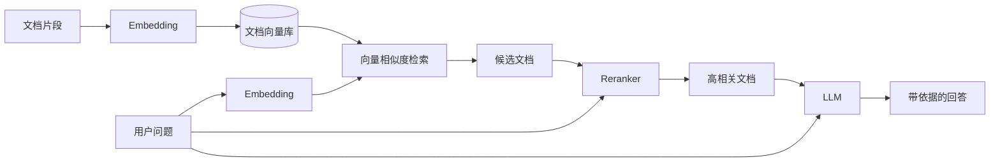

## 应用能力来自哪里

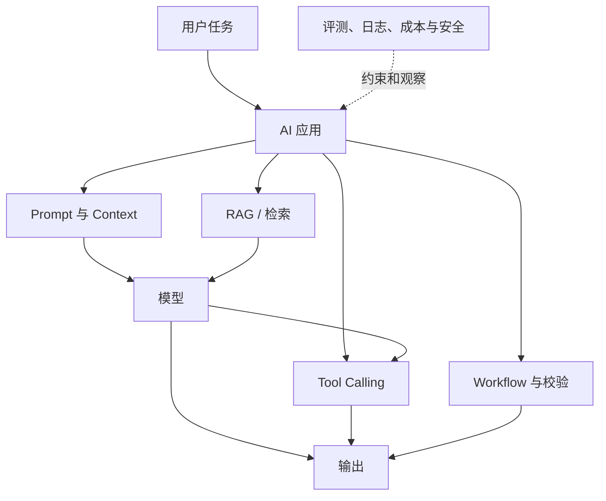

## 精选问答

### 1. LLM、Embedding 模型和 Reranker 分别返回什么？

LLM 返回生成的 Token 序列；Embedding 模型返回表达输入语义的数值向量；Reranker 返回候选内容的相关性分数或重新排序后的候选列表。

**一句话记忆：** LLM 生成内容，Embedding 召回相似内容，Reranker 给候选重新排队。

### 2. RAG、Tool Calling 和微调分别改变系统的哪一部分？

- RAG 改变模型推理时看到的上下文：先检索外部资料，再把相关资料交给模型，不修改模型参数。
- Tool Calling 扩展应用能够执行的外部动作：模型提出调用请求，应用负责校验、授权和执行。
- 微调通过训练改变模型参数，使某类行为、风格或专项能力更加稳定。

**一句话记忆：** RAG 补资料，Tool Calling 装手脚，微调改模型。

### 3. 为什么更大的模型不一定带来更好的应用效果？

应用效果由整条系统链路共同决定，包括输入资料、Prompt、检索、工具、工作流、输出校验和评测。大模型也可能带来更高成本和延迟。对于边界清楚的简单任务，小模型可能更快、更便宜且足够稳定。

**一句话记忆：** 模型只是系统的一部分，最终效果取决于整条链路。

### 4. 文档问答中三类模型如何协作？

Embedding 模型把问题和文档片段转换为向量；向量检索用相似度召回候选片段；Reranker 根据原始问题对候选片段精排；LLM 最后阅读高相关资料，生成带引用的回答。资料不足时，系统应拒绝猜测。

**一句话记忆：** Embedding 召回，Reranker 精排，LLM 作答。

#### Reranker 如何排序？

Reranker 不负责在全部文档中首次搜索。典型流程分成两阶段：

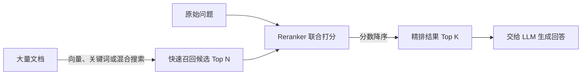

常见 Cross-Encoder Reranker 会把“问题 + 单个候选文档”一起输入 Transformer，让两边 Token 充分交互，再输出一个相关性分数。例如：

| 候选 | 示意分数 | 排名 |
| --- | ---: | ---: |
| 年假申请流程 | 0.96 | 1 |
| 考勤管理制度 | 0.41 | 2 |
| 出差报销说明 | 0.02 | 3 |

这些数字是排序用的示意分数，不一定是校准后的概率。Embedding 检索速度快，适合从大量文档中召回；Reranker 更慢但能更细致地比较 Query 和候选内容，所以只处理较小的候选集合。

最重要的边界是：**首次检索没有召回的文档，Reranker 无法找回来。**

**一句话记忆：** Retriever 负责从海量文档中找候选，Reranker 负责把候选重新排好。

##### 实战使用哪些现成技术？

核验日期：2026-07-18。

| 方案 | 接入方式 | 适合场景 | 主要代价 |
| --- | --- | --- | --- |
| Cohere Rerank | TypeScript 使用 SDK 或调用 `/v2/rerank` HTTP API | 快速验证、多语言资料、不想维护模型服务 | 外部 API 成本与数据合规 |
| Jina Reranker | 调用 `/v1/rerank` HTTP API | 多语言、长文档或需要不同 Reranker 架构 | 外部 API 成本与供应商依赖 |
| Sentence Transformers CrossEncoder | Python 加载预训练模型并调用 `predict()` 或 `rank()` | 离线、私有部署、需要控制模型 | 增加 Python/GPU 服务和运维成本 |

官方资料：[Cohere Rerank](https://docs.cohere.com/docs/rerank-overview)、[Cohere API](https://docs.cohere.com/reference/rerank)、[Jina Reranker](https://jina.ai/reranker/)、[Sentence Transformers CrossEncoder](https://sbert.net/docs/cross_encoder/usage/usage.html)。

本项目是 TypeScript + Fastify，推荐先定义统一接口：

```ts
interface Reranker {
  rerank(query: string, candidates: Candidate[], topK: number): Promise<ScoredCandidate[]>;
}
```

Day 6 先用 HTTP 托管 API将召回的 20–50 个片段精排到前 5 个，并用现有评测集比较“只有召回”和“召回 + 精排”。如果评测没有明显收益，就不应为了技术完整性强行保留 Reranker。

##### 文档切块在链路中的位置

是的，实际被 Embedding、召回和 Rerank 的通常是 Chunk，而不是整篇长文档：

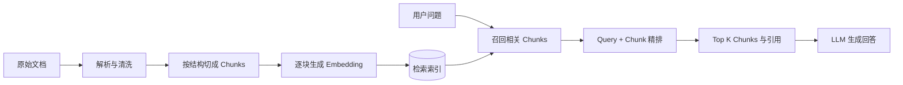

每个 Chunk 应携带 `documentId`、标题、章节、位置、来源和原始文本。切块大小存在取舍：

| 切块方式 | 优点 | 风险 |
| --- | --- | --- |
| 较大 Chunk | 上下文完整 | 主题混杂、成本高、可能截断 |
| 较小 Chunk | 定位精确 | 上下文断裂、候选和索引数量增加 |
| 适量重叠 | 缓解边界断裂 | 重复内容和成本增加 |

当前项目 Day 6 可以从按 Markdown 标题与段落切分开始，以每块约 300–500 Token、约 50 Token 重叠作为实验起点。它们不是标准答案：短文档可以保留完整，最终参数应根据 Recall@K、精排效果、引用质量、延迟和成本调整。

**一句话记忆：** 先切块再召回，Reranker 排的是候选 Chunk；切多大必须用评测决定。

### 5. 频繁变化的知识应该使用 RAG 还是微调？

优先使用 RAG。更新知识源后，只需删除或重新计算受影响的文档片段向量，通常不需要重建整个向量数据库。微调需要重新准备数据、训练和评测，也难以确保旧事实被彻底移除，因此不适合作为频繁变化事实的主要更新机制。

| 需求 | 优先方案 | 原因 |
| --- | --- | --- |
| 制度、价格或产品资料频繁变化 | RAG | 外部资料可增量更新，也容易展示引用 |
| 固定输出格式、语气或任务行为 | 微调 | 通过修改参数稳定模型行为 |
| 既要稳定行为又要最新知识 | 微调 + RAG | 行为和知识分别管理 |

只有更换 Embedding 模型、修改全局切分策略或需要重新处理全部数据时，才通常需要重建整个向量索引。

**一句话记忆：** 变化的事实放在 RAG，稳定的行为才考虑微调。

### 6. Token 和 Context Window 分别是什么？

Token 是模型 tokenizer 将文本等输入转换得到的离散编号单位。一个 Token 可能对应单词、单词片段、汉字、标点或空格组合；具体切分取决于模型，不能仅按肉眼看到的单词计数。

Context Window 是模型在一次请求中能够处理的 Token 总容量。系统指令、用户输入、历史消息、工具结果和检索资料都会占用输入空间，生成内容也需要输出预算。具体计算规则取决于模型和 API。

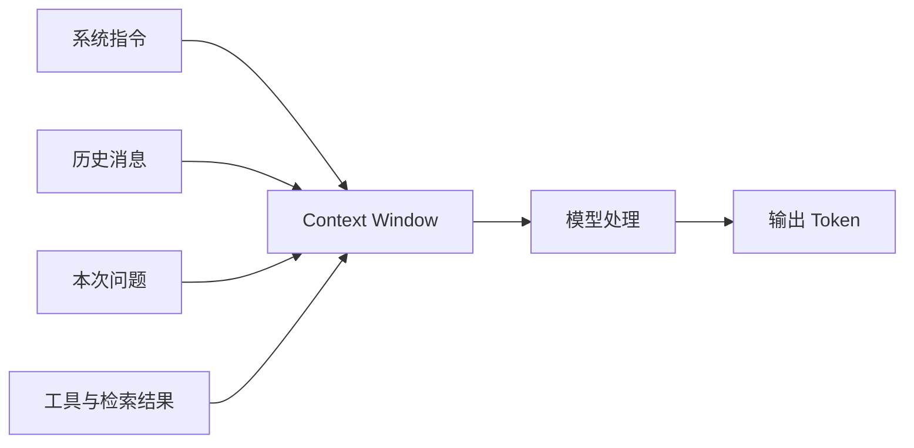

超出窗口时，API 可能拒绝请求，或者应用需要截断、删除、总结旧内容。被移出窗口的信息不能再被模型直接使用，可能导致遗忘或回答矛盾。

**一句话记忆：** Token 是模型读写的计量单位；Context Window 是一次请求能装下的容量，不是永久记忆。

### 7. Attention 和 Transformer 分别是什么？

Self-Attention 让每个位置根据上下文，为可见的其他 Token 分配不同相关权重，再汇总它们的信息。这里有两类不能混淆的权重：

| 名称 | 何时产生 | 是否随输入变化 |
| --- | --- | --- |
| 模型参数，如 Embedding、`WQ`、`WK`、`WV` | 通过训练和反向传播学习 | 训练完成后通常固定 |
| Attention 权重 | 使用模型处理当前输入时现场计算 | 会，每次输入和位置都可能不同 |

#### 模型参数是如何学会的？

模型参数最初近似随机。训练时，模型在海量文本上反复预测 Token：预测结果与正确 Token 之间形成 Loss，反向传播计算如何调整参数才能减小 Loss，然后优化器更新参数。大量重复后，能帮助预测的语法、指代和语义关联会分布式地编码在参数中。

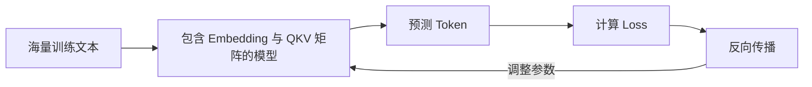

这不是人工写入“桌子比书稳固”的规则，而是模型为降低大量预测错误学到的统计结构。

#### 一次输入中的 Attention 权重如何计算？

对于位置 `i` 和可见位置 `j`，模型使用已学习矩阵计算：

```text
qᵢ = xᵢWQ       kⱼ = xⱼWK       vⱼ = xⱼWV
score(i,j) = qᵢ · kⱼ / √d
attention(i,·) = softmax(scores)
outputᵢ = Σ attention(i,j) × vⱼ
```

Query 和 Key 的点积产生相关性分数，Softmax 将分数转换为总和为 1 的权重，最后用这些权重混合 Value。训练参数决定模型“如何比较”，当前输入决定这一次“比较出了什么”。

#### 因果 Attention 的方向限制

生成式 LLM 通常使用因果 Attention：当前位置只能查看之前的 Token。因此在“我把书放在桌子上，因为它很稳固”中，“它”所在位置不能向后查看“稳固”。当模型在完整句子之后生成回答时，回答位置已经能回看整句，才可以综合“桌子”“它”和“稳固”等线索。

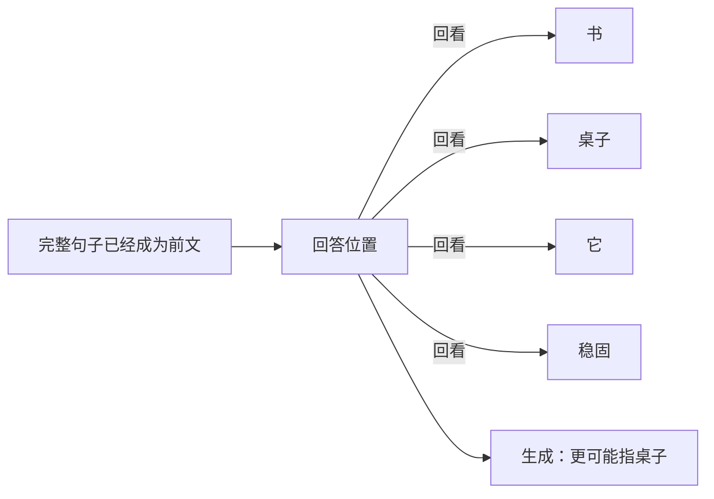

图中的高低权重只能作为示意。真实模型具有多层、多头 Attention，最终答案由整套网络共同产生，不能从某一条连线直接读出完整推理过程。

Transformer 是以 Attention 为核心的神经网络架构。典型层还包括前馈网络、残差连接、归一化和位置信息，多层堆叠后逐步形成丰富的上下文表示。

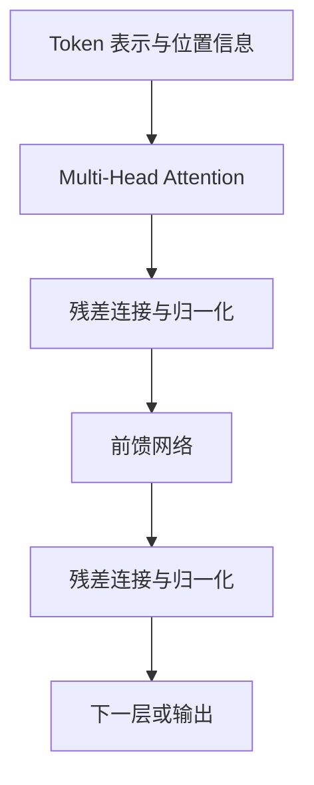

现代 LLM 通常基于 Transformer，但两者不是同义词：Transformer 是架构，LLM 是经过大规模语言数据训练的模型。

**一句话记忆：** 训练学会“如何比较”，Attention 针对当前输入现场算“该关注谁”。

### 8. 模型层、应用层和工程层如何分工？

| 层次 | 主要职责 | 典型能力 |
| --- | --- | --- |
| 模型层 | 提供通过训练获得的基础推理能力 | LLM、Embedding 模型、Reranker、多模态模型 |
| 应用层 | 将模型、上下文、知识和动作组织成具体任务 | Prompt、RAG、Tool Calling、Workflow、Agent |
| 工程层 | 让系统可靠、可测、可诊断、可运营 | 重试、日志、评测、安全、缓存、成本与延迟监控 |

LLM 可以生成答案，但 Embedding 模型输出的是向量。Prompt 和 RAG 可以改善模型得到的信息，Tool Calling 则进一步让应用能够读取数据或执行外部动作。重试处理暂时性故障，日志支持诊断，评测衡量系统质量。

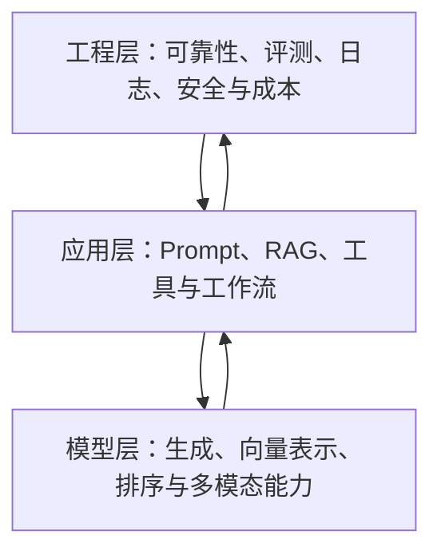

这是一种分析系统的概念分层，不要求每层都部署成独立服务。

**一句话记忆：** 模型层提供能力，应用层组织任务，工程层保证系统可靠、可测、可运营。

### 9. 如何公平、可重复地比较两个模型？

模型对比不是各运行一个例子，而是一个受控实验：

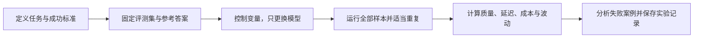

#### 固定条件

- 相同输入和评测数据集
- 相同系统指令、Prompt 和输出 Schema
- 相同工具、检索资料和上下文
- 尽可能相同的温度、最大输出及其他推理配置
- 明确记录模型版本、运行日期、Prompt 版本和数据集版本

#### 记录指标

| 维度 | 会议行动项提取示例 |
| --- | --- |
| 正确性 | 行动项准确率、召回率，负责人和截止时间字段正确率 |
| 稳定性 | Schema 通过率、重复运行波动、API 失败率 |
| 失败模式 | 遗漏、虚构行动项、错误负责人、无效日期 |
| 性能 | 延迟、输入与输出 Token |
| 经济性 | 单次和整套评测成本 |
| 可用性 | 盲测或人工评分，是否需要大量修改 |

单次运行不能代表整体效果：样本可能不具代表性，输出存在随机波动，服务也可能发生暂时性错误。应覆盖多种真实样本，对重要样本适当重复，并比较均值、波动和分类失败案例。

统一条件的实验衡量模型在同一设置下的差异；如果还想比较各模型的最佳能力，可以增加“分别优化 Prompt 和参数”的实验，但必须与统一条件结果分开报告。

**一句话记忆：** 固定任务、数据和条件，只改变模型；同时测质量、速度、成本和波动。

### 10. Day 1 如何启动主线项目？

Day 1 的目标不是实现 AI 功能，而是让项目的范围、样例和运行方式可验证。

| 类别 | 最小产出 |
| --- | --- |
| 问题与边界 | 目标用户、三个核心用例、明确不做的内容 |
| 评测素材 | 10 个真实问题，其中至少 3 个无答案问题 |
| 样例数据 | 5–10 份安全文档、3 份脱敏会议记录及人工行动项 |
| 项目骨架 | 应用目录、测试目录、README、`.env.example`、凭据忽略规则 |
| 可重复验证 | 一条启动命令、一个健康检查或 Hello World、一个自动测试 |

“知识召回率”和“Owner 正确率”可以作为后续指标，但 Day 1 需要先定义它们：

- 检索 Recall@K：人工标记的相关片段是否出现在前 K 个检索结果中。
- Owner 正确率：有明确 Owner 的行动项中，预测 Owner 与人工标注一致的比例。
- 无依据拒答率：资料中没有答案时，系统是否避免猜测。

没有真实资料时可以先使用明确标记的合成数据，但最终评测应补充经过授权和脱敏的代表性真实样本。

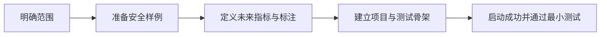

**一句话记忆：** 第一天先定义边界、准备可评测样本，并用一次启动和一个测试证明项目骨架可复现。

### 实践速查：npm workspace 命令

仓库根目录通过 npm workspaces 同时管理学习站和 `apps/assistant`。安装已有依赖直接执行：

```bash
npm install
```

向助手应用新增依赖时，将 `<package>` 替换成真实包名，不要输入尖括号：

```bash
npm install zod --workspace @ai-native/assistant
npm install --save-dev typescript --workspace @ai-native/assistant
```

根目录的 `assistant:*` 脚本会把命令转发给应用工作区，因此通常不需要 `cd apps/assistant`。

### 实践概念：什么是技术地图？

技术地图不是术语清单，而是由概念节点和有含义的连接组成的认知模型：

- 节点说明“它是什么、解决什么问题”。
- 连线说明“依赖、限制、提供、测量或替代”等关系。
- 节点记录还应包含适用场景、失败模式和项目证据。

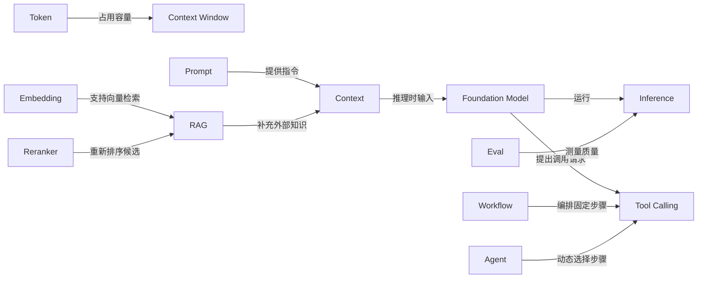

Day 1 的目标不是画得漂亮，而是能借助地图解释各技术如何协作，以及什么时候不应该使用它们。

## 常见误区

- Embedding 输出的是数值向量，不是 Token。
- Embedding 不只处理问题，文档也需要预先转换为向量。
- Reranker 通常只重新排序候选，不负责在全部文档中完成首次召回。
- Reranker 分数主要用于同一 Query 下的相对排序，不应默认解释为真实概率。
- 切块越大或越小都不一定更好；Chunk 大小与重叠需要结合真实问题评测。
- 基础 RAG 流程中的 LLM 主要负责生成，不应把生成和检索混为同一步。
- 模型提出工具调用，不等于模型可以绕过应用的权限和参数校验直接执行操作。
- 文档变化通常只需要增量更新相关向量，不等于每次都要重建整个向量数据库。
- Token 不等于单词；同一文本在不同 tokenizer 下可能有不同 Token 数量。
- Context Window 不是永久记忆，窗口更大也不保证所有细节都能被同等准确地利用。
- Attention 权重不是答案正确性的保证，也不能简单当作模型推理过程的完整解释。
- Transformer 是模型架构，不等于 LLM；许多非语言模型也可以使用 Transformer。
- Embedding 模型属于模型层，但输出向量而不是答案。
- Tool Calling 不只是补充信息，还允许应用在校验和授权后执行外部动作。
- 不要依据单个样本或单次运行宣布某个模型更好。
- 自动总分不能替代对遗漏、幻觉和其他失败案例的人工分析。
- 不要在 Day 1 就实现 RAG、Agent 或复杂界面；先让范围和骨架可验证。
- 检索召回率、引用覆盖率和答案正确率是不同指标，不能混用同一个“召回率”。
- 命令文档中的 `<package>` 是占位符，不是需要原样输入的包名。
- 只有术语而没有关系、边界和证据的列表，不算技术地图。
