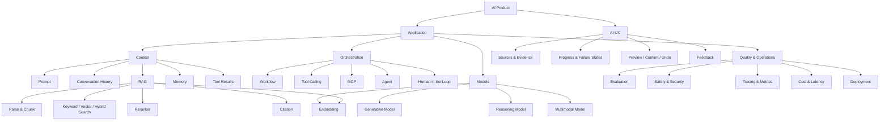

# AI 技术地图

最后更新：YYYY-MM-DD

## 使用规则

每个节点必须包含：一句定义、解决的问题、至少一个连接、适用场景和主要失败模式。没有关系的术语清单不算技术地图。

## 起始地图

## 节点记录

### 节点名称

- 一句定义：
- 解决的问题：
- 输入与输出：
- 上游依赖：
- 下游影响：
- 适用场景：
- 不适用场景：
- 主要失败模式：
- 替代方案：
- 实验或项目证据：

复制此小节，为关键节点建立记录。

## 每日修改记录

| 日期 | 新增/修改节点 | 原因 | 证据 |
| --- | --- | --- | --- |
| YYYY-MM-DD | 示例：RAG | 原定义没有区分检索与生成 | Day 6 实验 |
